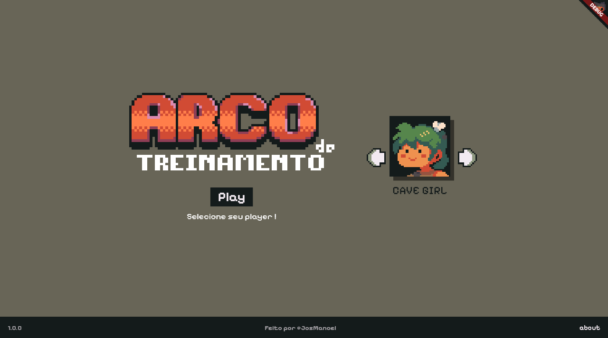
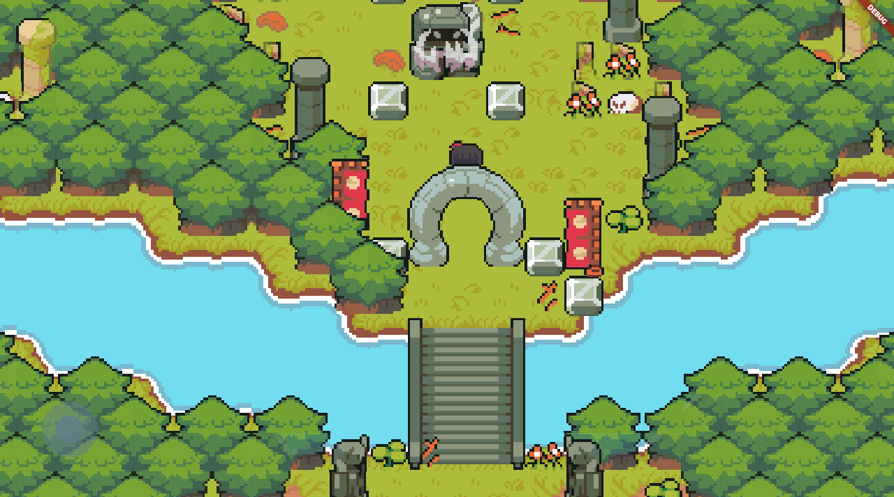
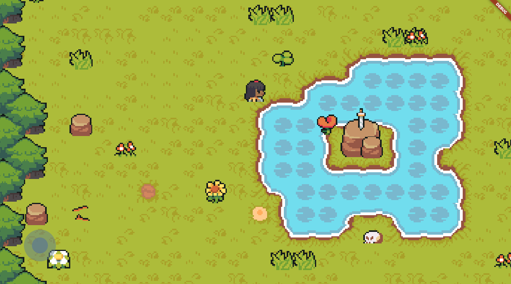
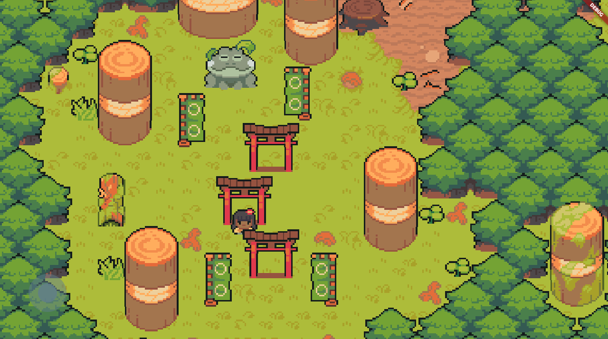
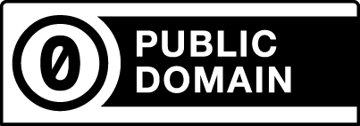

<div align="center">
  
</div>

<h1 align = "center">
  Arco de Treinamento: Supreme Kai World
  <p align="center">
    
<!--     <- Versao de lançamento-->
    
    
  </p>
</h1>

<p align ="center">
<a href= "#sobre-este-projeto">🕹️ Sobre este projeto</a> &nbsp;&nbsp;&nbsp;|&nbsp;&nbsp;&nbsp;
<a href="#executar">🖥️ Como executar</a> &nbsp;&nbsp;&nbsp;|&nbsp;&nbsp;&nbsp;
<a href="#leitura">📚 Leitura e links recomendados</a> &nbsp;&nbsp;&nbsp;|&nbsp;&nbsp;&nbsp;
<a href="#licenca">📜 Licenças</a>
</p>

<hr>

<h2 id="sobre-este-projeto">
  <div>
    
    Sobre este projeto
  </div>
</h2>

Esse projeto visa agrupar todos os repositórios produzidos por mim ([JosManoel](https://github.com/JosManoel)) em cursos e certificações com o intuito de facilitar o acesso por terceiros, criado para funcionar como um portifólio interativo, utilizando os assets do **"Ninja Adventure Asset Pack"** e fonte **"Pixelify Sans"**, utilizando o **Flutter** com a biblioteca **Bonfire** e **Flame**.
<div align="center">
</div>

<div align="center"  width="80%">
  
  <table>
    <tr>
      <td></td>
      <td></td>
      <td></td>
    </tr>
  </table>
</div>

<hr>

<h2 id="executar">🖥️ Como executar</h2>

Antes de executar o Game é necessário atualizar todas as dependências do projeto. Para executar essa ação, siga o código a seguir:

```bash
flutter pub get
```

> [!NOTE]
> A aplicação possui algumas dependências em versões anteriores que podem gerar conflitos com o **Bonfire** quando atualizadas, sendo elas:
> **ffi 2.1.0**; **material_color_utilities 0.5.0**; **meta 1.10.0**; **path 1.8.3**.

> [!WARNING]
> A partir da versão 1.15.0 do **Flame** o **Bonfire** apresenta um conflito de chamada com a biblioteca **Flame** que se estende para as suas versões anteriores. Mantenha o **Bonfire** na versão **3.2.0** e o **Flame** em **1.14.0** até que tudo seja solucionado.

Originalmente o Supreme Kai World foi pensado para rodar apenas em um ambiente Web, mas também possui total compatibilidade com outros sistemas suportados pelo Flutter. Para incluir outros sistemas ao projeto, execute o comando a seguir, trocando _"plataforma"_ pela plataforma desejada:

```bash
flutter create --platforms=plataforma .
```
Você pode também listar todas as plataformas desejadas em um único comando. Exemplo: 

```bash
flutter create --platforms=windows,linux .
```
Para executar o game basta compilar utilizando o seguinte comando na raiz do projeto:

```bash
flutter run
```

<hr>

<h2 id="leitura">📚 Leitura e links recomendados</h2>

* [Flutter - Criando mapas para o Bonfire com o Tiled](https://medium.com/@ManoelFreitas/flutter-criando-mapas-para-o-bonfire-com-o-tiled-fd89ca9c4261).
* [Flutter - Creating maps for bonfire with Tiled](https://medium.com/@ManoelFreitas/flutter-creating-maps-for-bonfire-with-tiled-340e16b83f80).
* [Flame Docs](https://docs.flame-engine.org/latest/index.html).
* [Bonfire Docs](https://bonfire-engine.github.io/#/).
* [Tiled Documentation](https://doc.mapeditor.org/en/stable/).

<hr>

<h2 id="licenca">📜 Licenças</h2>

- Este projeto está sob a licença [MIT](https://github.com/Arco-de-Treinamento/supreme_kai_world/blob/main/LICENSE).
- Assets criados por [Pixel-Boy](https://twitter.com/2Pblog1) e [AAA](https://www.instagram.com/challenger.aaa/?hl=fr). Disponíveis na itch.io sob a licença [CC0](https://pixel-boy.itch.io/ninja-adventure-asset-pack).
- [Pixelify-Sans](https://github.com/eifetx/Pixelify-Sans) criada por [Stefie Justprince](https://github.com/eifetx). Disponível no Google Fonts sob a licença [OFL](https://github.com/eifetx/Pixelify-Sans/blob/main/OFL.txt).

  <p>
    
    
    
  </p>

<hr>

<div align = "center">
  
  👋🏾 Feito por [JosManoel](https://github.com/JosManoel) com 🕹️ , 🎧 e 🔥.
</div> 
